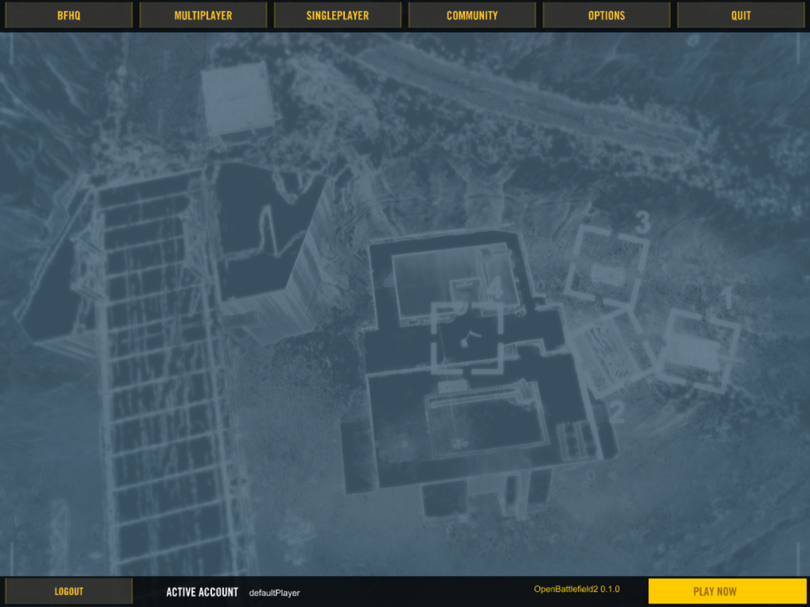
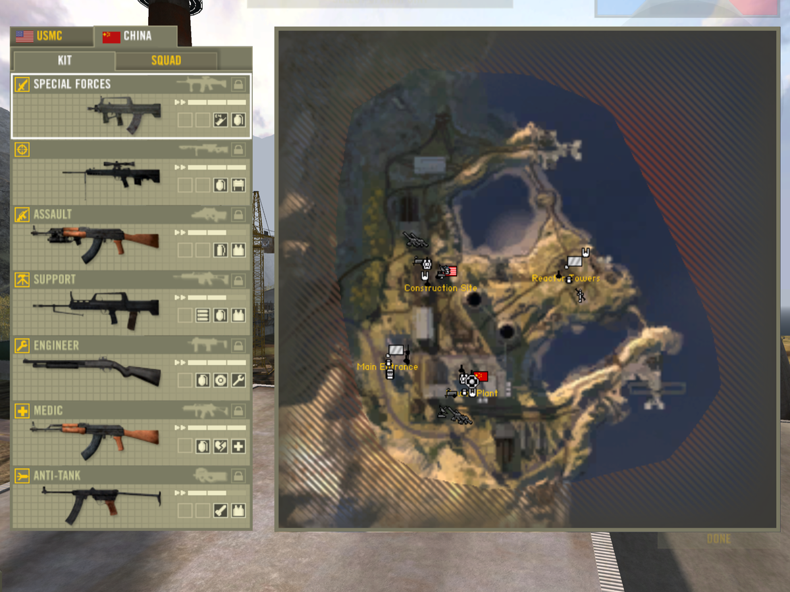
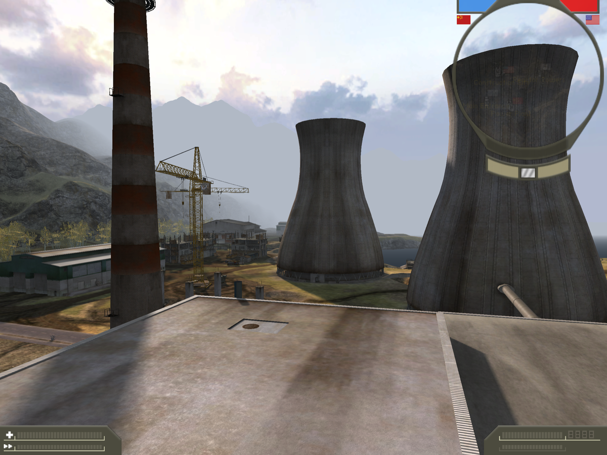
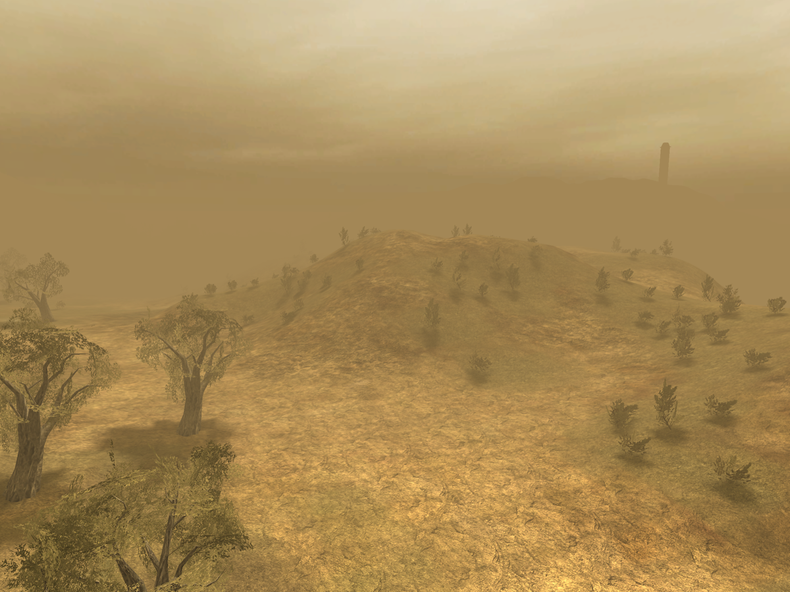
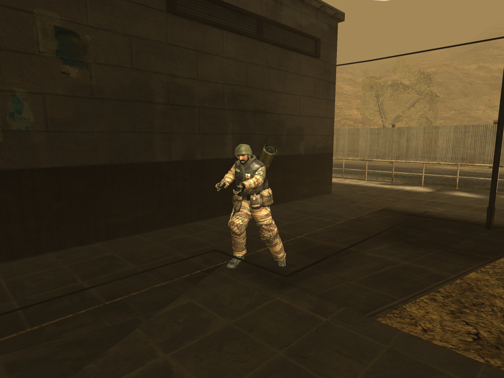
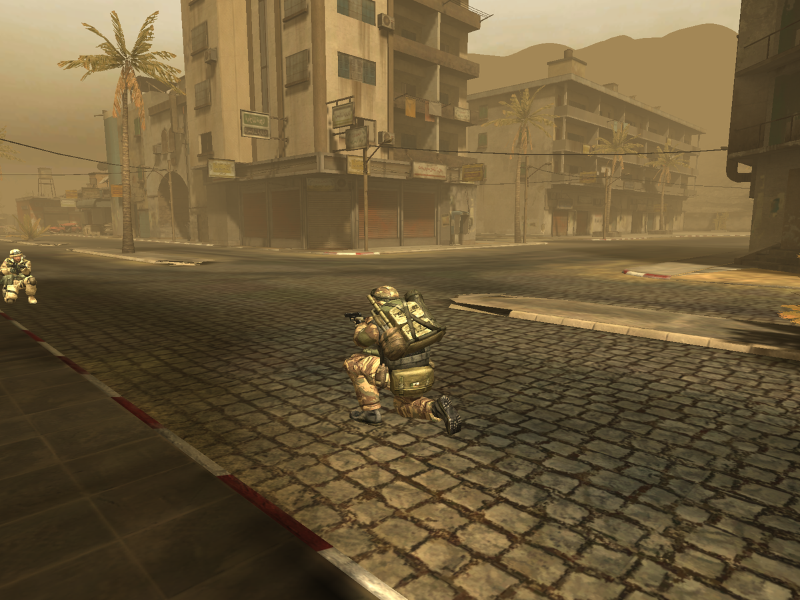
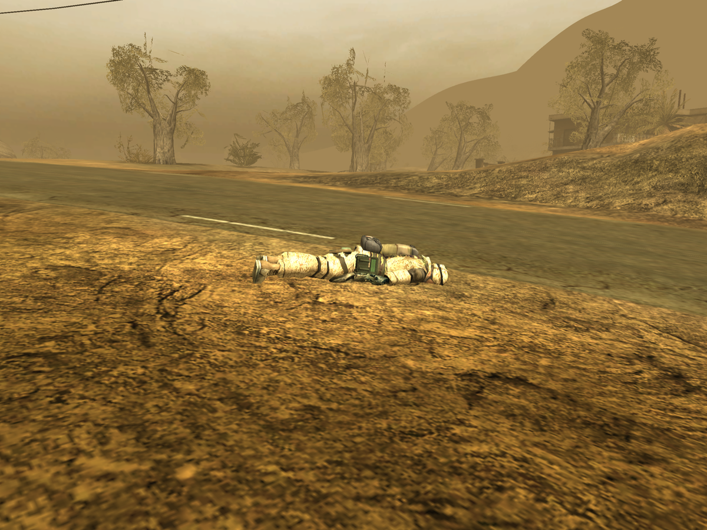

# OpenBattlefield2

A clean-room reimplementation of DICE's **Refractor 2** engine — the engine
behind *Battlefield 2* (2005) — in C++20.

It is an engine, not a game: it ships no content and reads the files of
**your own** installed copy of Battlefield 2. Without that copy there is
nothing to run.

The goal is a **one-to-one port**, not a game "inspired by" the original.
Every rule in `src/` names where it came from — an address in the original
binary, a line in the game's data, or a measured frame of the original — and
where the original's behaviour is not known yet it is written down as debt
instead of being filled in with a guess.

## Status

A research project in progress. What works today, against an original
Battlefield 2 1.5 installation and an **original dedicated server**:

* **Main menu** — the game's own `mainMenu.swf`, played by
  [Ruffle](https://github.com/ruffle-rs/ruffle) with a bridge that answers the
  calls the movie makes into the engine: localisation, the player's profiles
  from `Documents/Battlefield 2`, the installed maps from each level's `.desc`.
* **Levels** — the archives read in place, terrain with its detail
  materials, roads, water, sky, static meshes with their baked light maps,
  vegetation, and the collision the soldiers walk on.
* **Joining a real server** — `openbf2 --connect <host>` does the original's
  handshake, loads the level the server names, and stays in the game. Every
  record the server's ghost stream sends is read to exactly its length:
  players (score, ping, team, squad, kit, alive), spawn groups, soldiers
  (position, angles, pose, the weapon out, a dead soldier's ragdoll) and
  vehicles' positions.
* **Your own soldier** — moved by the engine's own soldier physics (the tick,
  the jump, sprint, terrain and object contacts), predicted on the client the
  way the original does; on a live server 343 of 344 of the server's states
  agree with the prediction to within a millimetre.
* **Other players** — drawn as their soldier, kit and the weapon they have
  out, animated by the game's own animation systems (stand, crouch, prone,
  run, the weapon's own clips), and, when they die, laid down by a port of the
  engine's ragdoll driven by the server's particles.
* **HUD** — built from the game's own `.con` node tree, animated by the
  `MemeFile` graph from `Menu/Ingame`: the spawn screen with the server's own
  spawn points, the countdown to the next spawn, the minimap, the scoreboard
  with the server's numbers.
* **Singleplayer** — a local server and client on a loop (`--hosted`).

What is not there yet, among much else (the full list is in `CLAUDE.md`,
"Debt"): firing and the weapons in your own hands, entering and driving
vehicles, sound, the commander and squad screens. Bink video is not decoded,
there is no anti-cheat, and no game content is redistributed.

## Screenshots

Everything below is our engine on macOS/arm64, reading an original Battlefield
2 1.5 installation. Every frame was made by the command printed under it, with
no hands on the keyboard. `--screenshot` writes a BMP; the images here are the
same frames as PNG.

The game's own `mainMenu.swf`, under Ruffle with our bridge:



```bash
openbf2 --frames 700 --click-at 300:490:285 --click-at 400:813:630 --screenshot menu-main.bmp
```

The spawn screen on Dalian Plant — kits, the minimap, control points, all
built from the game's own `.con` node tree:



```bash
openbf2 --level Dalian_plant --frames 8 --screenshot spawn-dalian.bmp
```

In the world after DONE — terrain, static meshes, the combat HUD:



```bash
openbf2 --level Dalian_plant --frames 120 \
    --click-at 20:730:585 --click-at 60:1110:833 --screenshot ingame.bmp
```

Strike at Karkand from a fixed camera, the interface off:



```bash
openbf2 --level Strike_at_Karkand --camera -134/175/-250 --angles 20 -8 \
    --no-hud --frames 8 --screenshot karkand.bmp
```

### On a live server

These three come from an original Linux dedicated server with bots, so what
is in the frame is whatever the bots were doing; the commands are the ones
that took them. `--watch-soldier` holds the camera beside another player's
soldier, `--watch-weapon <item>` beside one with that item out,
`--watch-ragdoll` beside a dead one.

A bot running with his launcher on his back, animated by the game's own
animation system from what his ghost carries:



A bot crouched behind his pistol — the pose (crouch) and the weapon out
(item 2, the pistol) both read from his state:



A dead bot, laid down by the engine's ragdoll: the server sends four of the
body's particles, the client simulates the rest:



```bash
# the running bot (frame 1600) and the body (frame 4400) are from one run
openbf2 --connect <host> --frames 6000 --no-hud --watch-ragdoll \
    --screenshot-at 1600:live-soldier.bmp --screenshot-at 4400:live-ragdoll.bmp

openbf2 --connect <host> --width 800 --height 600 --frames 1900 --no-hud \
    --watch-weapon 2 --screenshot-at 800:live-pistol.bmp
```

## Requirements

* An installed **Battlefield 2 1.5** (any edition); the mod directory is given
  with `--mod`, default `Game Files/mods/bf2`.
* macOS on arm64 is the main platform. The `windows-x64` preset is kept
  building but is not exercised.
* CMake 3.24+, Ninja, a C++20 compiler, **SDL3**.
* Optional, for the Flash menu: **Rust** and a checkout of Ruffle in
  `reference/ruffle` (see `docs/research/11-ruffle-menu.md`). Without them the
  `obf2_flash` module is skipped and everything else still builds.

## Build

```bash
cmake --preset macos-arm64-debug
cmake --build --preset macos-arm64-debug
ctest --test-dir build/macos-arm64-debug --output-on-failure
```

Some tests read your installation (`Game Files/`) and pass with a note when it
is not there; the network tests run on captures of a live server kept in
`tests/data/`.

Every push to `master` is built and tested by GitHub Actions on macOS arm64
(`.github/workflows/ci.yml`), and the run keeps `openbf2` with its SDL3 beside
it as an artifact, `openbf2-macos-arm64-<commit>.tar.gz`, for 30 days. That
build has no Flash menu — Ruffle is not part of it — so it is started with
`--level` or `--connect`.

## Run

```bash
# The menu (the game's own movie), then singleplayer from there
./build/macos-arm64-debug/src/app/openbf2

# Straight into a level
./build/macos-arm64-debug/src/app/openbf2 --level Dalian_plant

# A local server and client, with the round's settings from the game's data
./build/macos-arm64-debug/src/app/openbf2 --hosted --level Strike_at_Karkand

# Join an original dedicated server. No `--level`: the server names the level
# it runs, and the client mounts that one
./build/macos-arm64-debug/src/app/openbf2 --connect <host>
```

The switches that measure rather than play — every one of them leaves a frame
or a number behind:

| switch | what it gives |
|---|---|
| `--frames N`, `--screenshot f.bmp`, `--screenshot-at N:f.bmp` | run N frames and keep a frame |
| `--click-at N:x:y`, `--exec-at N:line` | a click or a console line at frame N |
| `--camera x/y/z --angles yaw pitch`, `--no-hud` | a fixed view, for comparing against the original (`tools/bf2_run.sh` puts the original in the same spot) |
| `--hud-rects`, `--hud-vars`, `--hud-screen <name>` | what the HUD drew, which of its variables nobody fills, one screen of it |
| `--watch-soldier`, `--watch-pose N`, `--watch-weapon N`, `--watch-ragdoll` | the camera beside another player's soldier, one in a pose, with a weapon out, or dead |
| `--record f.bin` | the server's packets, for the tests and `capture_scan` |
| `--calibrate f.bin` | the server's template numbers matched to names |

At the end of a run the client prints its report: how every record type was
read, how other players were drawn, how many ragdoll frames had a particle
through a wall, how long the HUD's rebuilds took.

## Layout

| directory | what it is |
|---|---|
| `src/` | the engine, one module per subject |
| `tests/` | one test per parsed subject; nothing counts as understood without one |
| `tools/` | scripts and small programs that pull facts out of the binaries and the game's data |
| `docs/` | what was reversed, and where it came from |
| `third_party/` | vendored single-file libraries: miniz, stb |

| module | what it does |
|---|---|
| `core` | platform, paths, maths, the loading phases' thread pool |
| `vfs` | the game's archives, mounted the way the original's `fileManager` does |
| `con` | lexer and interpreter for the `.con` language |
| `texture`, `mesh`, `anim` | `.dds`; meshes, skeletons, skinning, collision; the animation systems and the ragdoll |
| `font`, `loc` | `.dif` fonts, `.utxt` localisation |
| `game` | the `ObjectTemplate` registry, the scene, a soldier's model |
| `level` | terrain, water, placement, `GamePlayObjects.con` |
| `gfx` | window and GPU (SDL3 + SDL_GPU) — the only place with graphics |
| `hud`, `meme` | the `hudBuilder` node tree and its states; the `MemeFile` animation graph |
| `net` | BitStream, the protocol, events, the ghost stream's records |
| `server` | local server, soldier physics, the collision world |
| `session` | the live link to a server: the handshake, the world it keeps, our action stream |
| `engine` | console, settings, key bindings |
| `flash` | the Flash menu: Ruffle behind a C ABI |
| `app` | the `openbf2` executable: command line, scene, renderer, menu, the world on screen |

Where the notes are:

* `docs/functions/` — one file per subject reversed from the binary, every
  claim with its address: the network events and records
  (`network-events.md`, `player-state.md`, `spawn.md`), the soldier's physics
  and model (`soldier-physics.md`, `soldier-model.md`, `ragdoll.md`), the HUD
  (`hud-*.md`), the menu bridge (`menu-bridge.md`);
* `docs/formats/` — the file formats: `.con`, meshes, skeletons, animation,
  levels, the HUD's graph, the network protocol;
* `docs/research/` — prior art, the first passes, frame dumps of the original.

Two directories are **not** in git and must be provided locally:
`Game Files/` (your own installation) and `reference/` (third-party sources
used for comparison; their licences differ from ours).

Reversing the binary goes through Ghidra over MCP. That configuration is
nothing but absolute paths to one machine, so it is not in git either: copy
`.mcp.json.example` to `.mcp.json` and fill in your own.

## How the project works

One pass is a measure first (a command, a number, a screenshot), then the
answer from the binary or the game's data, then the notes and the code, then
the measure again. A constant with no source is not written down; it is
recorded as "not measured". `CLAUDE.md` states the rules the project holds
itself to and keeps the list of what is still not reversed; `docs/` holds the
notes each of them refers to.

## Licence

MIT — see `LICENSE`. This covers **our** code only. Battlefield 2 and its
content belong to their respective owners; nothing from the game is included
here.
